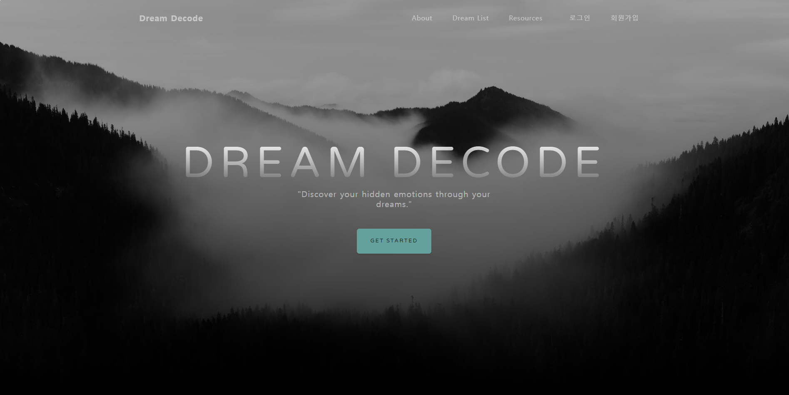
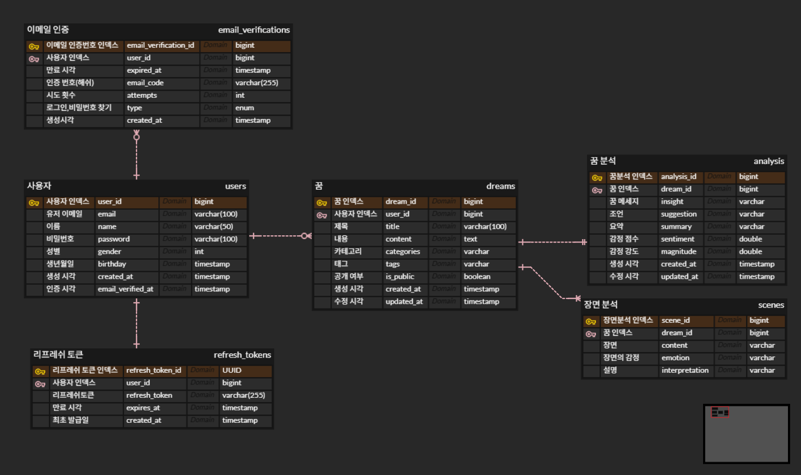

# DreamDecode

꿈을 기록하고 AI로 심리 분석해주는 커뮤니티 기반 플랫폼

> "Discover your hidden emotions through your dreams."

## 📸 메인 화면



## 🚀 배포 주소

- **프로덕션**: http://43.202.160.188:8080/
- **API 문서**: http://43.202.160.188:8080/swagger-ui/index.html

## 프로젝트 개요

DreamDecode는 사용자가 자신의 꿈을 기록하고, AI 기술을 활용하여 심리적으로 해석해주는 웹 애플리케이션입니다. 꿈을 통해 자신의 감정과 무의식을 탐구하고, 다른 사용자들과 꿈을 공유하며 서로의 경험을 나눌 수 있는 커뮤니티 플랫폼을 제공합니다.

## 주요 기능
### AI 자동 분석
- **Alan AI 심리 분석**: 꿈 내용을 기반으로 주요 장면 분석, 심리적 해석, 조언 제공
- **Google NLP 감정 분석**: 감정 점수(-1.0 ~ 1.0) 및 감정 강도 측정
- **자동 카테고리 분류**: 꿈의 주제를 카테고리로 자동 분류
- **태그 생성**: 꿈의 주요 키워드를 태그로 자동 생성

### 꿈 관리
- **꿈 등록 및 수정**: 제목, 내용, 공개 여부 설정
- **내 꿈 조회**: 개인 대시보드에서 내가 작성한 꿈 목록 확인
- **꿈 삭제**: 본인이 작성한 꿈만 삭제 가능


### 꿈 탐색
- **공개 꿈 목록**: 모든 사용자가 공개된 꿈을 조회 가능
- **검색 기능**: 제목 키워드로 검색
- **필터링**: 카테고리별, 태그별 필터링
- **페이지네이션**: 대량 데이터 효율적 처리

### 사용자 인증
- **회원가입**: 이메일 기반 회원가입
- **이메일 인증**: 회원가입 시 이메일 인증 필수
- **JWT 인증**: Access Token(2시간) + Refresh Token(14일)
- **보안**: HttpOnly 쿠키 사용, XSS 공격 방지

## 🛠 기술 스택

### Backend


### Frontend


### AI & Cloud Services


### Tools


## 🏗 아키텍처


## 📊 ERD (Entity Relationship Diagram)



### 주요 엔티티 관계
- **User** (1) ──< (N) **Dream**: 한 사용자는 여러 꿈을 작성할 수 있음
- **Dream** (1) ──< (1) **Analysis**: 각 꿈은 하나의 분석 결과를 가짐
- **Dream** (1) ──< (N) **Scene**: 각 꿈은 여러 장면으로 분석됨
- **User** (1) ──< (1) **RefreshToken**: 각 사용자는 하나의 리프레시 토큰을 가짐
- **User** (1) ──< (N) **EmailVerification**: 이메일 인증 이력 관리

## 📁 프로젝트 구조

```
DreamDecode/
├── src/main/java/est/DreamDecode/
│   ├── config/          # 설정 클래스 (Security, JWT, OpenAPI)
│   ├── controller/      # REST API 컨트롤러
│   ├── domain/          # JPA 엔티티 (Dream, User, Analysis, Scene)
│   ├── dto/             # 데이터 전송 객체 (Request, Response)
│   ├── exception/       # 커스텀 예외 처리
│   ├── repository/      # JPA Repository 인터페이스
│   ├── service/         # 비즈니스 로직 (Dream, Analysis, Auth 등)
│   └── util/            # 유틸리티 클래스
└── src/main/resources/
    ├── templates/       # Thymeleaf 템플릿 (HTML)
    └── static/          # 정적 리소스 (CSS, JS, Images)
```

## 📦 클래스 구조

### Domain Layer
```
domain/
├── User.java              # 사용자 엔티티
├── Dream.java             # 꿈 엔티티
├── Analysis.java          # 꿈 분석 결과 엔티티
├── Scene.java             # 장면 분석 엔티티
├── RefreshToken.java      # 리프레시 토큰 엔티티
└── EmailVerification.java # 이메일 인증 엔티티
```

### Service Layer
```
service/
├── DreamService.java              # 꿈 관리 비즈니스 로직
├── AnalysisService.java           # AI 분석 처리
├── NaturalLanguageService.java    # Google NLP 통합
├── AuthService.java               # 인증/인가 처리
├── UserService.java               # 사용자 관리
└── EmailVerificationService.java  # 이메일 인증 처리
```

### Controller Layer
```
controller/
├── DreamController.java           # 꿈 관리 API
├── AnalysisController.java        # 분석 조회 API
├── AuthController.java            # 인증 API (로그인/로그아웃)
├── UserController.java            # 사용자 관리 API
├── UserProfileController.java     # 프로필 관리 API
├── EmailVerificationController.java # 이메일 인증 API
└── PasswordController.java        # 비밀번호 관리 API
```

### Config Layer
```
config/
├── SecurityConfig.java      # Spring Security 설정
├── JwtTokenProvider.java    # JWT 토큰 생성/검증
├── JwtTokenFilter.java      # JWT 인증 필터
├── JwtProperties.java        # JWT 설정 프로퍼티
└── OpenApiConfig.java       # Swagger 설정
```

## 🔄 AI 분석 프로세스

1. **꿈 등록/수정**: 사용자가 꿈을 등록하거나 수정하면 자동으로 AI 분석이 트리거됩니다.

2. **Alan AI 분석**: 
   - 꿈 내용을 프롬프트로 전달
   - 주요 장면 2~4개 추출 및 감정 분석
   - 심리적 해석 및 조언 생성
   - 카테고리 및 태그 자동 생성

3. **Google NLP 감정 분석**:
   - Alan AI가 생성한 요약(summary)을 Google NLP로 전달
   - 감정 점수(Score) 및 감정 강도(Magnitude) 계산

4. **결과 저장**: 분석 결과를 데이터베이스에 저장하여 상세 조회 시 표시

## 📝 개발 컨벤션

### 네이밍 규칙
- **클래스명**: PascalCase (예: `DreamService`, `UserController`)
- **메서드명**: camelCase (예: `getDreamById`, `addOrUpdateAnalysis`)
- **상수**: UPPER_SNAKE_CASE (예: `RT_MAX_AGE`, `PAGE_SIZE`)
- **변수명**: camelCase (예: `dreamId`, `userEmail`)

### 패키지 구조
- **계층별 분리**: Controller → Service → Repository
- **도메인별 분리**: 각 도메인(Dream, User, Analysis)별로 Service/Controller 분리

### 코드 스타일
- **Lombok 활용**: `@RequiredArgsConstructor`, `@Getter`, `@Setter` 등 적극 활용
- **불변 객체**: DTO는 record 또는 final 필드 사용
- **예외 처리**: 커스텀 예외 클래스로 명확한 에러 메시지 제공

### 커밋 메시지
```
feat: 새로운 기능 추가
fix: 버그 수정
refactor: 코드 리팩토링
test: 테스트 코드 추가/수정
docs: 문서 수정
style: 코드 포맷팅
chore: 빌드 설정 변경
```

### API 설계
- **RESTful 원칙**: HTTP 메서드와 상태 코드 적절히 사용
- **DTO 분리**: Request/Response DTO로 계층 간 데이터 전달

## 📚 API 문서

Swagger UI를 통해 API 문서를 확인할 수 있습니다.

- **로컬**: http://localhost:8080/swagger-ui.html
- **프로덕션**: http://43.202.160.188:8080/swagger-ui.html

## 주요 특징

- **RESTful API**: 표준 REST API 설계 원칙 준수
- **JWT 기반 인증**: 안전한 사용자 인증 및 권한 관리
- **AI 통합**: Alan AI와 Google NLP를 활용한 자동 분석
- **페이지네이션**: 대량 데이터 효율적 처리
- **Swagger 문서화**: API 자동 문서화
- **보안**: Spring Security를 통한 보안 강화

## 라이선스

이 프로젝트는 교육 목적으로 개발되었습니다.
